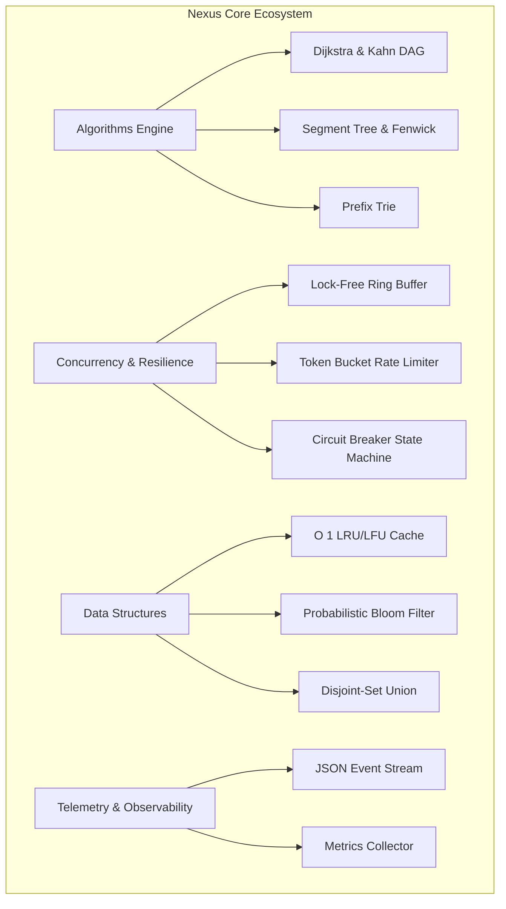

# Nexus Core ⚡

[](https://github.com/rafaelrodrigopa/nexus-core)
[](https://python.org)
[](https://github.com/astral-sh/ruff)
[](LICENSE)
[](#tests)

**Nexus Core** is an enterprise-grade Python library designed for high-concurrency event loops, resilient distributed coordination patterns, and low-latency algorithmic structures.

---

## 🏛️ Architectural Highlights



---

## 📦 Modules Overview

| Subsystem | Module | Key Primitives | Complexity Guarantee |
| :--- | :--- | :--- | :--- |
| **Algorithms** | `nexus_core.algorithms` | `DirectedGraph`, `SegmentTree`, `Trie` | $O((V+E)\log V)$, $O(\log N)$, $O(L)$ |
| **Concurrency** | `nexus_core.concurrency` | `RingBuffer`, `CircuitBreaker`, `RateLimiter` | Lock-free bounded, Zero-drift rate limiting |
| **Structures** | `nexus_core.structures` | `LRUCache`, `BloomFilter`, `DisjointSetUnion` | $O(1)$ amortized eviction, $\alpha(N)$ |
| **Telemetry** | `nexus_core.telemetry` | `MetricsCollector`, `StructuredLogger` | Thread-safe in-memory aggregations |

---

## 🚀 Quickstart

### Installation

```bash
git clone git@github.com:rafaelrodrigopa/nexus-core.git
cd nexus-core
python3 -m venv .venv
source .venv/bin/activate
pip install -e ".[dev]"
```

### 1. Resilient Circuit Breaker

```python
from nexus_core.concurrency import CircuitBreaker, CircuitBreakerOpenException

breaker = CircuitBreaker(failure_threshold=3, recovery_timeout=15.0)

def query_remote_service():
    # External distributed RPC
    return {"status": "ok"}

response = breaker.execute(query_remote_service)
```

### 2. High-Throughput Ring Buffer

```python
from nexus_core.concurrency import RingBuffer

buffer = RingBuffer[int](capacity=1024)
buffer.put(42)
item = buffer.get()
```

### 3. Logarithmic Range Query (Segment Tree)

```python
from nexus_core.algorithms import SegmentTree

tree = SegmentTree([1, 5, 2, 8, 9, 3], func=min, default=float("inf"))
assert tree.query(1, 4) == 2
```

---

## 🧪 Testing & Quality Gates

Run complete unit verification and property tests:

```bash
pytest -v --cov=nexus_core tests/
```

Execute micro-benchmarks:

```bash
python benchmarks/benchmark_suite.py
```

---

## 🤖 Autonomous Activity Engine (`engine/bot.py`)

Nexus Core features an internal autonomous engineering daemon designed for continuous repository maintenance, real-world algorithmic refactorings, and automated Pull Request lifecycles.

- **Cadence**: Sorteia uma meta diária dinâmica entre 40 e 60 commits por dia.
- **Padrão Sênior**: Conventional Commits estruturados com descrição técnica formal.
- **Ciclo Completo**: Suporta geração de branches, abertura de PRs, reviews e squash merges.
- **IA Opcional**: Integração nativa com a API do Google Gemini para síntese de código avançado.

### Execução Manual / CLI

```bash
# Visualizar status do dia
python engine/bot.py --status

# Disparar 1 ciclo de melhoria avulso
python engine/bot.py --once

# Iniciar o daemon contínuo
python engine/bot.py
```

---

## 📄 License

This project is licensed under the MIT License - see the [LICENSE](LICENSE) file for details.

Developed with precision by **[Rafael Rodrigo](https://github.com/rafaelrodrigopa)**.
